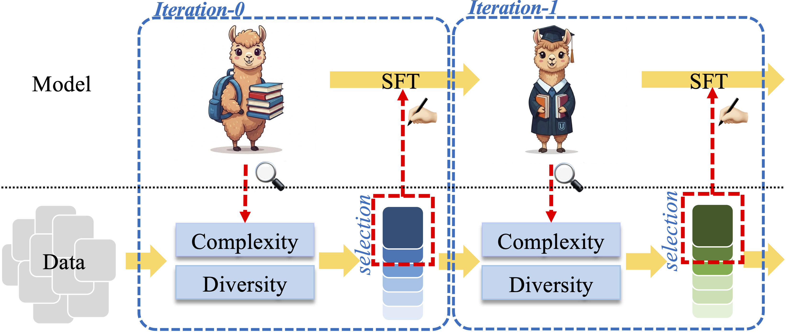

<div align= "center">
    <h1> Boosting LLM via Learning from Data Iteratively and Selectively </h1>
</div>

<div align= "center">
<p>
<a href="https://arxiv.org/abs/2412.17365">📖 Arxiv</a> |
<!-- <a href="https://huggingface.co/datasets">🤗 Dataset</a> | -->
<!-- <a href="https://asciieval.github.io/">🌐 Website</a>  -->
</p>
</div>

## Overview

Datasets nowadays are generally constructed from multiple sources and using different synthetic techniques, making data de-noising and de-duplication crucial before being used for post-training. In this work, we propose to perform instruction tuning by iterative data selection (IterIT). We measure the quality of a sample from complexity and diversity simultaneously. Instead of calculating the complexity score once for all before fine-tuning, we highlight the importance of updating this model-specific score during fine-tuning to accurately accommodate the dynamic changes of the model. On the other hand, the diversity score is defined on top of the samples' responses under the consideration of their informativeness. IterIT integrates the strengths of both worlds by iteratively updating the complexity score for the top-ranked samples and greedily selecting the ones with the highest complexity-diversity score. Experiments on multiple instruction-tuning data demonstrate consistent improvements of IterIT over strong baselines. Moreover, our approach also generalizes well to domain-specific scenarios and different backbone models.


<h1 align="center">

<br>
</h1>

## Installation

Clone this repo into your working directory and setup the environment:

```bash
git clone https://github.com/JiaQiSJTU/IterIT.git
cd IterIT
conda create -n IterIT python=3.10
conda activate IterIT
pip install -r requirements.txt
```

Major requirements with version information are listed in requirements.txt. 


## Data Preparation

Please download the datasets from corresponding sources and put them in the `data` folder with neccessary format transformation. Some of the dataset adopted in this work are listed below:
* alpaca: https://github.com/tatsu-lab/stanford_alpaca/blob/main/alpaca_data.json
* alpaca-gpt4: https://github.com/Instruction-Tuning-with-GPT-4/GPT-4-LLM/blob/main/data/alpaca_gpt4_data.json
* wizardlm: https://huggingface.co/datasets/WizardLMTeam/WizardLM_evol_instruct_70k
* dolly: https://huggingface.co/datasets/databricks/databricks-dolly-15k

The data file should be in the format of `json` with the following fields for each sample: 
* `instruction`: the user query or the task description
* `input`: the input of the instruction
* `output`: the reference response to the instruction

An example of the data file is shown in `data/examples.json`.

## Training

To train the model with IterIT, you can use the following command:

```bash
bash scripts/train_IterIT.sh
```

Some major parameters for IterIT are:
* `ratio`: the number of samples to be used in each epoch. The recommended value is 0.05.
* `update_ratio`: the number of samples to be updated after each epoch. The recommended value is 3.
* `update_strategy`: the strategy to update the samples. `iterative` refers to IterIT where the complexity score is updated during fine-tuning. `baseline` refers to previous baselines where the complexity score will not be updated once been computed outside of fine-tuning.
* `score_type`: the score adopted to measure the quality of each sample. `BOTH` refers to use both complexity and diversity scores. `IFD` refers to use the complexity score only.
* `diversity_weight_decay`: the weight decay of the diversity score. The recommended value is 0.1 for instruction tuning datasets and 0.0 for domain-specific datasets.


## Evaluation

Please refer to the following repository for evaluation:
* MixEval: [link](https://github.com/Psycoy/MixEval/)
* OpenInstruct: [link](https://github.com/allenai/open-instruct/tree/main/eval)
* Open LLM LeaderBoard: [link](https://github.com/EleutherAI/lm-evaluation-harness/tree/b281b0921b636bc36ad05c0b0b0763bd6dd43463)

The test scripts adopted in this work are listed in `eval_scripts/`.


## Citation

If you find this work useful for your research, please consider citing:

```bibtex
@article{jia2024iterit,
  title={Boosting LLM via Learning from Data Iteratively and Selectively},
  author={Jia, Qi and Ren, Siyu and Qin, Ziheng and Xue, Fuzhao and Ni, Jinjie and You, Yang},
  journal={arXiv preprint arXiv:2412.17365},
  year={2024}
}
```
